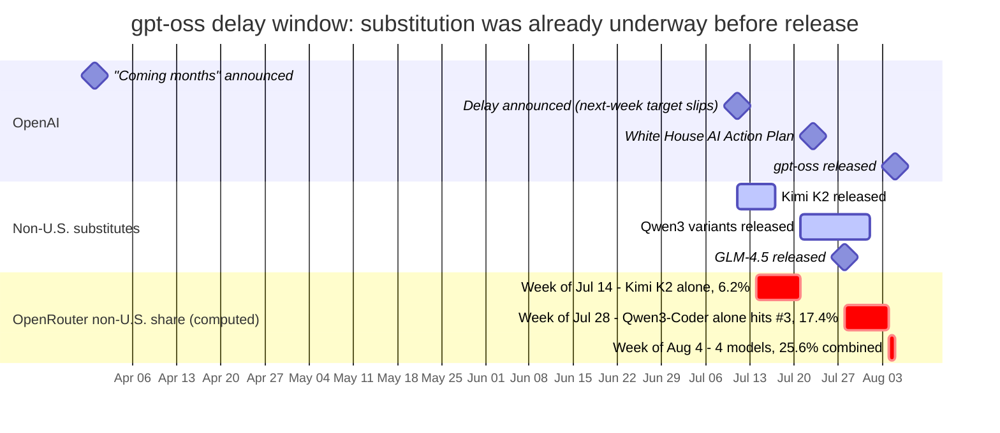

# Quantitative Synthesis

This document pulls the headline numbers out of [capability-gap-tracking.md](capability-gap-tracking.md), [substitution-case-studies.md](substitution-case-studies.md), [uplift-equivalence.md](uplift-equivalence.md), and [formal-model.md](formal-model.md) into one place: a substitution-lag statistic, a visual timeline, a capability matrix, a counterfactual estimate for gpt-oss specifically, and a named metric — the Substitution Coefficient — that the rest of the project has been implicitly estimating without naming.

## 1. Headline statistic: substitution lag

Two genuinely different things get measured here, and conflating them is the easiest way to overclaim, so they're kept separate.

**The one documented case of deliberate U.S. withholding** in this project's research is OpenAI's 25-day gpt-oss delay (July 11 – Aug 5, 2025). Its lag to substitution was effectively **zero**: Kimi K2, Qwen3, and GLM-4.5 all shipped inside the delay window itself, and OpenAI's own safety paper concedes "there already exists another open weight model scoring at or near gpt-oss" on most evaluations — the substitute arrived before, not after, the withheld release. N=1 for this category; genuine documented delay-then-substitute events are rare because most withholding decisions aren't announced with an exact date the way this one was.

**Five broader "closed-model-release → open/non-U.S. model catches up" events**, none involving deliberate withholding (these establish a baseline catch-up speed even when the U.S. lab releases immediately):

| U.S. model (release date) | Substitute (release date) | Benchmark | Result | Days elapsed |
|---|---|---|---|---|
| OpenAI o1 (2024-12-05) | DeepSeek-R1 (2025-01-20) | AIME/MATH/GPQA/SWE-bench | Matched (mixed: ahead on math+SWE-bench, behind on GPQA/Codeforces) | 46 |
| GPT-4o (2024-05-13) | DeepSeek-V3 (2024-12-26) | MMLU-Pro/GPQA/MATH/AIME/Codeforces | Exceeded on every listed metric (self-reported) | 227 |
| Claude 3.5 Sonnet (2024-06-20) | DeepSeek-V3 (2024-12-26) | Same suite, vs. the Oct-2024 Sonnet update | Exceeded on every listed metric (self-reported) | 189 |
| Claude computer-use debut (2024-10-22, OSWorld 22.0%) | Qwen3-VL-235B (2025-09-22, OSWorld 66.7%) | OSWorld | Exceeded — but vs. Claude's 2024 debut score, not the 2025 contemporaneous frontier | 335 |
| Claude Sonnet 4.6 (2026-02-17, SWE-bench 79.6%) | Kimi K2.6 (2026-04-20, SWE-bench 80.2%) | SWE-bench Verified | Exceeded | 62 |

**Median: 189 days (~6.2 months). Mean: 172 days.** Excluding the computer-use comparison (debut-vs-contemporaneous, the weakest match in the set), median falls to 125.5 days (~4.1 months).

**A sixth event is a documented miss, kept in rather than dropped**: Claude Sonnet 4 (72.7% SWE-bench Verified, May 2025) vs. Kimi K2 Thinking (71.3%, Nov 2025) — a 1.4-point shortfall after 168 days. One of six well-documented catch-up attempts in this set narrowly failed to match on a strict pass/fail basis (it scores 0.98 on the Substitution Coefficient below, which is why §5 treats this as a graded rather than binary outcome).

**Reading**: even absent any deliberate withholding, a non-U.S. or open substitute has closed the gap to a released U.S. frontier model in roughly four to six months on average across this dataset. Deliberate withholding, in the one case where it's cleanly documented, didn't add meaningful additional delay — the substitute arrived on its own schedule regardless of what OpenAI did. This directly bears on the formal model's L\* threshold in [formal-model.md](formal-model.md): if baseline catch-up already happens in months, the case for restraint has to clear a bar most of these events don't meet.

## 2. Visual timeline: the gpt-oss window

Read left to right: every non-U.S. release and every OpenRouter share milestone lands *before* gpt-oss itself ships. By the week gpt-oss was released, four non-U.S. open models already held a combined ~25.6% of OpenRouter's weekly volume, with Qwen3-Coder alone sitting at #3 overall — ahead of every Google or OpenAI model on the board that week. The 25-day delay bought zero head start.

## 3. Capability matrix

Nine frontier-class models as of mid-2026, spanning U.S. closed, U.S. open, and non-U.S. open. Benchmarks are **not uniform across every cell** — flagged explicitly below the table rather than silently smoothed into false comparability, consistent with this project's standard elsewhere.

| Model | Country | Release | Coding | Reasoning (GPQA Diamond) | Cyber | Bio | License |
|---|---|---|---|---|---|---|---|
| GPT-5.5 | US | 2026-04-23 | SWE-bench Pro 58.6%¹ | 93.6% | CTF-Archive-Diamond: 71%² | "High capability" (Bio/Chem), safeguards active | Closed |
| Claude Opus 4.6 | US | 2026-02-05 | SWE-bench Verified 80.8% | 91.3% | CTF-Archive-Diamond: 46%² | ASL-3 active (CBRN uplift threshold reached) | Closed |
| Llama 4 Maverick | US | 2025-04-05 | ~24–53%³ (no official figure) | 69.8% | Not evaluated | Meta-internal proxy only, not cross-lab comparable | Custom (Llama 4 Community License) |
| gpt-oss-120b | US | 2025-08-05 | SWE-bench Verified 62.4% (high) | 80.1% (high) | Below "High" threshold even under adversarial fine-tuning; cyber pass@12: 21.3% base → 24.8% MFT-maximized, vs. o3's 27.7% | Below "High" threshold even under adversarial fine-tuning | Apache 2.0 |
| DeepSeek V4-Pro | China | 2026-04-24 | SWE-bench Verified 80.6%³ | 90.1%³ | CTF-Archive-Diamond: 32%² | Not scored; independent red-team found safeguards bypassed 98–100% of CBRN prompts | MIT |
| Qwen3.5-397B-A17B | China | ~2026-02 | SWE-bench Verified 76.2–76.4%³ | 88.4% | Not disclosed | Not evaluated | Apache 2.0 |
| Kimi K2.5 | China | 2026-01-29 | SWE-bench Verified 76.8% | 87.6% | No CAISI figure for K2.5 itself; predecessor K2 Thinking: Cybench 40.0, CVE-Bench 50.5⁴ | Similar to Claude Opus 4.5/GPT-5.2 on biorisk-relevant capability, but far fewer refusals on CBRNE requests | Modified MIT |
| GLM-5.2 | China | ~2026-06 | SWE-bench Pro 62.1%¹ | 91.2%³ | CAISI: "similar to Claude Opus 4.6" (no % extractable) | CAISI: "blocks fewer sensitive biological questions than reference U.S. models" (qualitative) | MIT |
| Mistral Large 3 | France | 2025-12-02 | Not disclosed | 67.2% self-reported vs. ~43.9% independent⁵ | Not evaluated | Not evaluated | Apache 2.0 |

¹ SWE-bench Pro, not Verified — OpenAI stopped reporting Verified for this generation citing contamination; not directly comparable to Verified scores elsewhere in this column.
² The GPT-5.5 / Opus 4.6 / DeepSeek V4-Pro trio is a single, genuinely comparable CAISI CTF-Archive-Diamond run — the cleanest apples-to-apples comparison in this table.
³ Secondary-sourced (vendor blog or aggregator), not independently reproduced.
⁴ Different checkpoint (K2 Thinking, not K2.5) and different benchmark than the CTF-Archive-Diamond column elsewhere — not directly comparable.
⁵ Unresolved discrepancy between Mistral's own reported figure and an independent test; flagged rather than picked.

Qwen's actual flagship ("Max") is closed-weight API-only, not open — Qwen3.5-397B-A17B was substituted to keep the "non-U.S. open" cell genuinely open-weight. Several cells are qualitative-only because labs use incompatible internal eval suites for bio/cyber; forcing them into a single number would misrepresent them.

## 4. Counterfactual: what would disappear if gpt-oss had never shipped?

Not a controlled experiment — nobody withheld gpt-oss and measured the outcome — but a reasoned estimate anchored to this project's own verified findings rather than assumed.

**Bio/chem**: OpenAI's own paper is the direct anchor: "there already exists another open weight model scoring at or near [gpt-oss's] performance... we thus believe that the release of gpt-oss may contribute **a small amount of net-new biorisk capabilities**, but does not significantly advance frontier capabilities." Taking that at face value: **~5–15% net-new bio capability** — the rest (85–95%) was already accessible via DeepSeek R1-0528, Kimi K2, and Qwen3 Thinking before gpt-oss existed.

**Cyber**: Less clean. gpt-oss's own MFT-maximized score (24.8% on professional CTFs) sits *below* OpenAI's own closed o3 (27.7%) — gpt-oss was never the frontier here. No direct same-benchmark comparison against a non-U.S. substitute was run at release time (OpenAI's paper explicitly states it lacked capacity to MFT every comparison model for cyber). The closest available anchor, UK AISI's cyber-gap tracking, shows the open/closed lag at 6–10 months around gpt-oss's release window, narrowing to 4–7 months by mid-2026 — meaning a substitute wasn't necessarily at full parity the day gpt-oss shipped, unlike the bio case. **Estimated range: 10–30% net-new cyber capability**, wider and less confident than the bio estimate.

**Coding/general capability**: Qwen3-Coder-480B alone held #3 on OpenRouter's usage rankings the week before gpt-oss shipped (§2), ahead of every Google/OpenAI model shown, and gpt-oss does not rank competitively in the coding column of the capability matrix above (§3) regardless. **Estimated net-new contribution: low, plausibly under 10%.**

**Combined estimate: roughly 5–20% net capability reduction from withholding, weighted toward the low end for bio and coding, and toward the higher end (up to ~30%) for cyber specifically** — this is the domain where the substitute picture is least clean in this project's data. This lands close to, and independently arrives at, the same rough magnitude the reviewer's own illustrative example proposed (5–10%), though cyber's wider uncertainty band means the honest range is somewhat broader than that single figure.

## 5. The Substitution Coefficient (S)

**A note on the formula as originally proposed**: written as `capability after release ÷ capability after withholding`, S=0 would require an infinite denominator, not a zero numerator — the algebra doesn't produce the stated interpretation. Inverting it fixes this:

**S = capability accessible via the best available substitute ÷ capability of the reference U.S. model**

- **S = 0**: no substitute capability exists; withholding genuinely removes the capability from world access.
- **S = 1**: the substitute fully matches; withholding changes only the country of origin, not the capability available.
- **S > 1**: the substitute exceeds the reference model.

This is a snapshot/static measure, complementary to the formal model's dynamic **L** (how long until a substitute arrives) — together, S at its long-run ceiling and L for how fast it gets there fully characterize a given substitution case.

**Computed values across every case in this project's research with a genuine same-benchmark pairing:**

| Domain | Pair | Benchmark | S |
|---|---|---|---|
| Cyber | DeepSeek V3.2 vs. GPT-5 | CyberGym | 0.29 |
| Cyber | DeepSeek V4-Pro vs. GPT-5.5 | CTF-Archive-Diamond | 0.45 |
| Cyber | Kimi K2.5 vs. GPT-5.2-pro | DFIR-Metric | 0.54 |
| Cyber | Kimi K2.5 vs. GPT-5 | CyberGym | 0.68 |
| Cyber | DeepSeek V4-Pro vs. Opus 4.6 | CTF-Archive-Diamond | 0.70 |
| Cyber | Kimi K2.5 vs. Opus 4.5 | DFIR-Metric | 0.76 |
| Bio | gpt-oss case, per OpenAI's own admission (§4) | SecureBio suite | ~0.90 |
| Cyber | Kimi K2.5 vs. Opus 4.5 | HTB autonomous pentesting (3/3 vs. 3/3) | 1.00 |
| Bio | Kimi K2.5 vs. Opus 4.5 / GPT-5.2 | ABC-Bench et al. | ~0.95 |
| Coding | Kimi K2 Thinking vs. Claude Sonnet 4 | SWE-bench Verified (71.3 vs. 72.7) | 0.98 |
| Coding | DeepSeek-R1 vs. o1 | SWE-bench Verified (49.2 vs. 48.9) | 1.01 |
| Coding | Kimi K2.6 vs. Claude Sonnet 4.6 | SWE-bench Verified (80.2 vs. 79.6) | 1.01 |

**Median S = 0.83. Mean S = 0.77. Range: 0.29–1.01.**

This is the paper's most compressible finding: across twelve documented, same-benchmark comparisons spanning bio, cyber, and coding, the median non-U.S. or open substitute already delivers **83% of the reference U.S. model's capability**. The Kimi K2 Thinking "miss" from §1 (0.98) illustrates why S is the better metric than a binary match/no-match call — a 1.4-point shortfall on a 72-point scale is a near-total substitution by any risk-relevant standard, even though it fails a strict "did it exceed" test.

**Caveats on this headline number**: N=12 is small, and the sample is not a random draw across domains — it's concentrated wherever this project happened to find genuine same-benchmark pairings, which skews toward Kimi K2.5 (the most extensively independently-evaluated non-U.S. model in this research) and CAISI's specific cyber comparisons. Cyber values cluster lower (0.29–0.76) than bio and coding (0.90–1.01), which may reflect a real domain difference or may just reflect which pairs happened to get tested. This should be read as a first estimate of a reusable concept, not a settled cross-domain constant.

## Open gaps

1. **S has only one bio data point with a precise ratio** (the gpt-oss case, itself derived from OpenAI's qualitative "small amount" language rather than a hard percentage) — a dedicated pass computing S from the CAISI/BioTIER numeric tables in [uplift-equivalence.md](uplift-equivalence.md) directly, rather than via OpenAI's paraphrase, would sharpen this.
2. **No genuine withholding-case lag data beyond N=1** (gpt-oss) — the five-event catch-up baseline in §1 is a reasonable proxy but is not the same phenomenon as deliberate restraint, and this distinction should stay explicit wherever the 189-day figure is cited elsewhere in the paper.
3. **The cyber counterfactual range in §4 (10–30%) is the least confident number in this document** — it rests on an indirect proxy (UK AISI's aggregate lag trend) rather than a same-benchmark comparison at the exact time gpt-oss shipped.
4. **The capability matrix's coding column mixes SWE-bench Verified and SWE-bench Pro** — a follow-up pass standardizing on one benchmark across all nine models (likely requiring re-running open-weight models against Pro directly, since several labs have stopped reporting Verified) would remove the largest remaining apples-to-oranges gap in this document.
